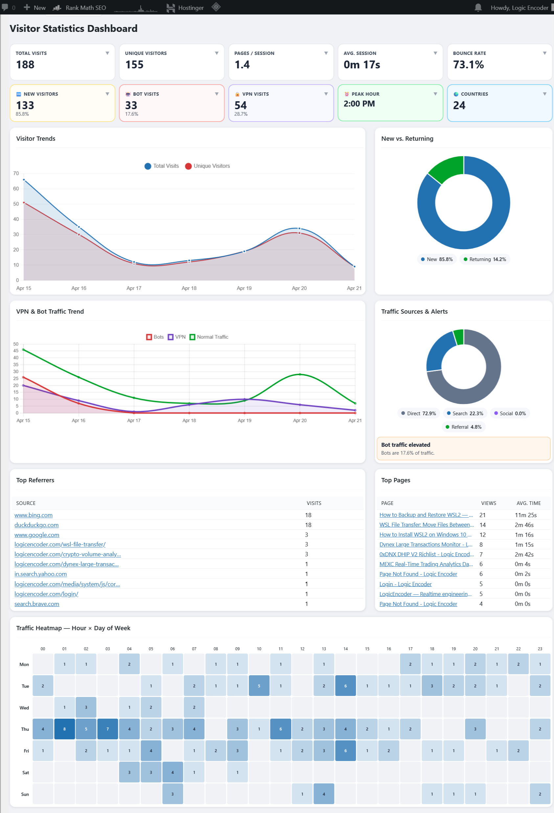
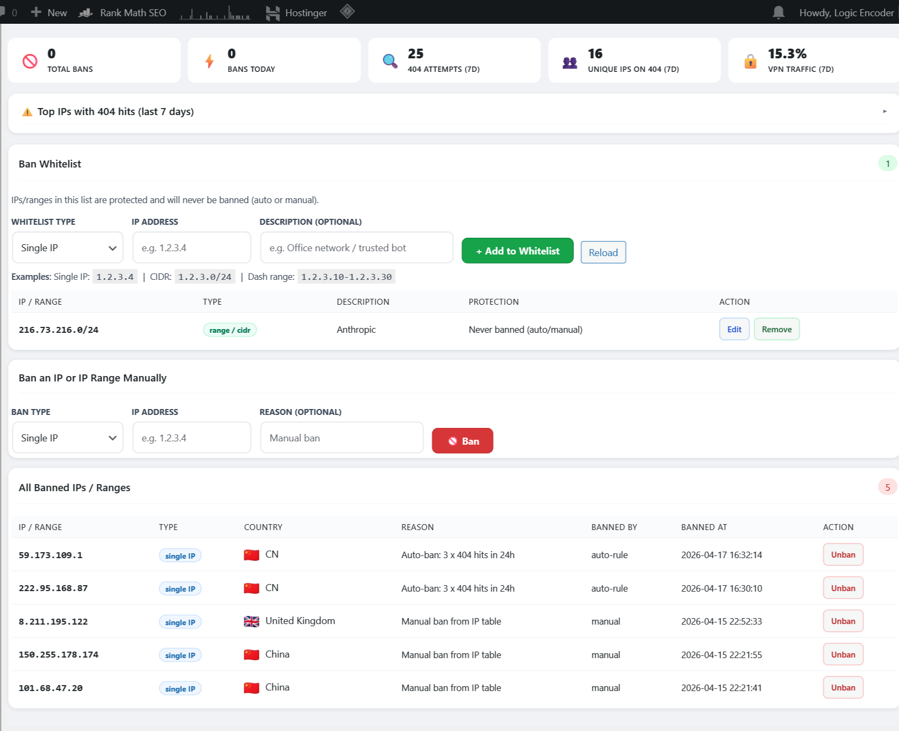
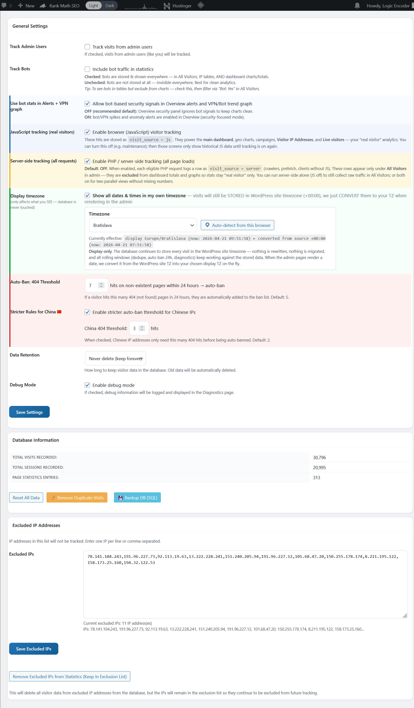
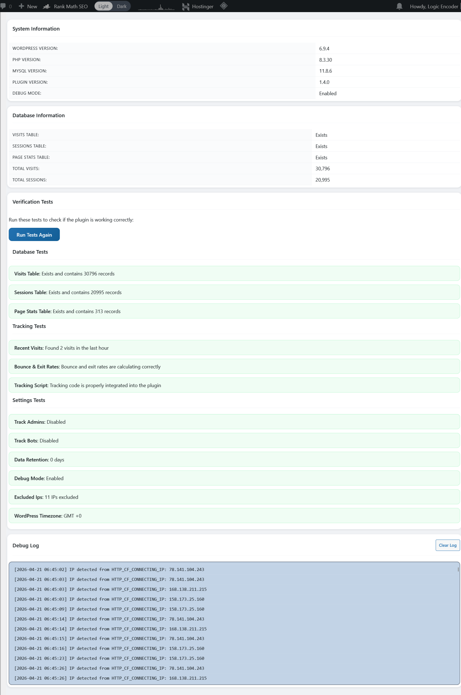

# WP Visitor Stats — WordPress plugin



**WP Visitor Stats** is first-party analytics for [logicencoder.com](https://logicencoder.com): page views, geography, technology mix, UTM campaigns, custom events, live sessions, IP bans, and a built-in URL shortener — all inside WordPress wp-admin. Data stays in your database under operator control; there is no third-party analytics dashboard or off-site clickstream export.

The plugin pairs a **browser beacon** (Chart.js dashboards, geo maps, campaigns) with an optional **server-side fallback** (raw request log for traffic that never runs JavaScript). Operators get one menu for marketing insight and abuse response without opening hosting panels.

## Tech stack

| Layer | Technologies |
|-------|--------------|
| WordPress plugin | PHP single-file (`wp-visitor-stats.php`, ~9.7k LOC) + `js/admin.js` (~3.8k LOC), inline admin CSS |
| Persistence | WordPress options + MySQL |
| Admin charts | Chart.js 3.9, DataTables 1.11 (server-side pagination), Leaflet 1.9 on geo map |
| Front-end tracking | Inline JS beacon, `sendBeacon` for exits/scroll/events, nonce-protected POST |
| Geo / VPN | IP lookup with country, region, city, and VPN/proxy flags |
| Security | IP and CIDR bans at `init`, auto-ban on repeated 404 patterns, ban whitelist |
| Short links | Public `{yoursite}/go/{slug}` → 301 redirect with click attribution |
| Integration | Tracking snippet embeds on static HTML from [mexc-live-stats-plugin](https://github.com/logicencoder/mexc-live-stats-plugin-overview) snapshot pages |
| Hosting | WordPress on shared hosting; wp-admin operator UI only |

## Why operators use it

Logic Encoder runs many public surfaces — gas tracker, MEXC coin pages, DNX tools, shop landings, member flows. You need to know **which pages convert**, **where traffic originates**, and **which IPs probe 404s** — without shipping full sessions to external SaaS. WP Visitor Stats answers that in one sidebar:

- **Dashboard KPIs and trends** with shared date presets across reports.
- **Per-IP forensics** with filters, expandable detail, and CSV export on the JavaScript visit stream.
- **Live visitor strip** with configurable auto-refresh for the last few minutes of activity.
- **Geo, content, and technology breakdowns** for editorial and product decisions.
- **UTM campaign tables** and **custom event counters** for experiments.
- **Ban list and auto-ban rules** that return HTTP 403 before WordPress renders abusive clients.
- **URL shortener** with per-link click stats on the same domain.

Front-end tracking respects toggles for admins, bots, excluded IPs, and JavaScript on/off. Server-side mode logs separately and appears on the **All Visitors** screen for a complete request picture.

## JavaScript vs server-side tracking

Two independent pipelines feed different screens:

| Stream | When it runs | Where you see it |
|--------|----------------|------------------|
| **JavaScript** | Browser beacon on public pages (default on) | Overview, Geo, Content, Technology, Campaigns, Custom Events, IP Addresses, Live Visitors |
| **Server-side** | Optional PHP log on each eligible request (default off) | **All Visitors** only |

Dashboard charts and KPI tiles intentionally exclude server-side rows so marketing metrics reflect real browser sessions. **All Visitors** is the combined forensic log when you need crawlers, prefetch, or no-JS clients. The IP Addresses screen shows a **JS checker only** badge; All Visitors shows **JS + Server**.

## Admin menu layout

Top-level wp-admin menu **Visitor Stats** (chart-bar icon). Thirteen submenu screens:

| Screen | Primary use |
|--------|-------------|
| **Overview** | KPI tiles, trend charts, traffic sources, heatmap by hour × weekday |
| **IP Addresses** | Searchable visit log (JavaScript hits only), filters, CSV export, ban action |
| **Live Visitors** | Active sessions in the last five minutes |
| **Geo Reports** | World map and country/region/city tables |
| **Content Analysis** | Page performance, entry/exit pages, 404 report |
| **Technology** | Browser, OS, and device charts and tables |
| **Campaigns** | UTM attribution and in-admin tracking guide |
| **Custom Events** | Named event rollups and front-end API docs |
| **All Visitors** | Combined JavaScript + server-side log with source filter |
| **Ban List** | Whitelist, manual bans, auto-ban summary, unban |
| **URL Shortener** | Create `/go/` links, toggle active, per-link stats |
| **Diagnostics** | Environment info, self-tests, optional debug log tail |
| **Settings** | Tracking modes, retention, exclusions, database tools |

## Shared date range control

Analytic pages (Overview, Geo, Content, Technology, Campaigns, Custom Events) share the same **Date Range** bar at the top:

| Preset | Window |
|--------|--------|
| Today | Current calendar day |
| Yesterday | Previous calendar day |
| Last 24 Hours | Rolling twenty-four hours |
| Last 3 / 7 / 30 Days | Rolling windows (7 days is the default) |
| This Month / Last Month | Calendar month boundaries |
| Last 2 / 6 Months | Rolling multi-month windows |
| Custom Range | Start + end date pickers with **Apply** |

Each page has its own **Refresh Data** button (spinner while loading). Hidden fields carry the active start/end dates and page id so AJAX reloads stay scoped to the screen you are on. Admin timestamps can display in a **custom timezone** when enabled in Settings — storage remains in the WordPress site timezone.

## Overview dashboard

The **Overview** screen is the daily health check. Ten **expandable metric tiles** sit in two rows — click any tile to flip open an inline breakdown table without leaving the page:

| Tile | Headline metric | Expand reveals |
|------|-----------------|----------------|
| **Total Visits** | All JS hits in range | Visit distribution detail |
| **Unique Visitors** | Distinct IPs/sessions | Unique breakdown |
| **Pages / Session** | Average depth | Session depth detail |
| **Avg. Session** | Mean session length | Duration breakdown |
| **Bounce Rate** | Single-page sessions | Bounce detail |
| **New Visitors** | First-time vs returning split | New/return detail |
| **Bot Visits** | Bot-classified hits (when tracking bots) | Bot volume detail |
| **VPN Visits** | VPN/proxy flagged hits | VPN detail |
| **Peak Hour** | Busiest hour of day | Hourly distribution |
| **Countries** | Country count | Top country list |

Four **Chart.js** panels sit below the tiles:

| Chart | What it shows |
|-------|----------------|
| **Visitor Trends** | Visit volume over the selected range |
| **New vs. Returning** | Doughnut split of first-time vs repeat sessions |
| **VPN & Bot Traffic Trend** | Line trend when bot stats feed alerts (settings-controlled) |
| **Traffic Sources** | Doughnut of referrer categories (direct, search, social, etc.) |

A **Traffic Sources & Alerts** panel can surface up to four security or anomaly notices when alert rules fire — including unusual bot-network provider patterns when that signal is available from geo lookup. Tables list **Top Referrers** and **Top Pages** with view counts and average time on page (URLs ellipsize on narrow columns). The **Traffic Heatmap** is a time-of-week grid (hour × weekday) showing aggregate visit intensity — not click-coordinate heatmaps.

Overview totals and charts use **JavaScript-tracked visits only**. The hero screenshot shows the expandable KPI row, four Chart.js panels, top referrers/pages tables, and the hour × weekday heatmap grid.

## IP addresses

**IP Addresses** is the forensic workbench for the JavaScript visit stream. The page badge reads **JS checker only** so you know server-side rows are excluded.

A server-side **DataTables** grid paginates through visits with columns: IP, visit time, country, page URL, referrer, browser, OS, device, bot flag, VPN flag, and actions. Column resize handles let you widen URL or referrer columns on large monitors.

**Filters** cover IP search, country dropdown, bot (All / Bots / Humans), VPN (All / VPN / Exclude VPN), and from/to date pickers. **Apply Filters**, **Reset**, and **Refresh** reload the grid without a full page reload.

**Export to CSV** downloads the current filter set as a spreadsheet (JavaScript visits only, capped at a high operator limit). Each row exposes:

| Action | Effect |
|--------|--------|
| **D** | Expand IP detail — geo context, ISP/org line when available |
| **B** | Open ban dialog — pre-fills IP for one-click block |


## Live visitors

**Live Visitors** answers “who is on the site right now?” — sessions active in the **last five minutes**.

The header shows a live **Active Visitors** count. The table lists IP, country flag (via flag CDN), time ago, page title and URL, browser, OS, and device.

| Control | Behaviour |
|---------|-----------|
| **Auto-refresh** toggle | Poll for new rows on an interval (default on) |
| Refresh rate | **5s**, **10s**, **30s**, or **60s** |
| **Refresh Now** | Immediate manual reload |

Use this screen during launches or incident response when you need near-real-time presence without waiting for aggregated dashboard charts to refresh.

## Geo reports

**Geo Reports** opens with three tabs — **Countries**, **Regions**, and **Cities** — each honouring the shared date range and **Refresh** control.

The **Countries** tab combines a **Leaflet** world map (OpenStreetMap tiles) with choropleth-style country colouring and a **Top Countries** table: flag, visits, unique visitors, VPN/proxy percentage, and share of total traffic.

The **Regions** tab ranks states/provinces with the same visit and unique-visitor columns. The **Cities** tab ranks municipalities for hyper-local campaigns or CDN tuning.


## Content analysis

**Content Analysis** answers “which URLs earn attention.” Four summary cards at the top show total page views, unique pages, average time on page, and average bounce rate for the range.

Three doughnut charts break down **traffic sources**, **devices**, and **top browsers**. The **Page Performance** table lists each URL with views, unique views, average time, bounce rate, and exit rate — sortable for finding high-exit landing pages.

Collapsible sections below expose:

| Section | Purpose |
|---------|---------|
| **Top 10 Entry Pages** | Where sessions start |
| **Top 10 Exit Pages** | Where sessions end |
| **Session Duration Distribution** | Histogram-style chart of session lengths |
| **Pages per Session** | Chart of depth distribution |
| **404 Error Pages** | URL, hit count, unique IPs — feeds auto-ban logic |


## Technology

The **Technology** screen charts **browser distribution** and **device distribution** (desktop, mobile, tablet) for the selected period. Sortable tables list browsers, devices, and operating systems with visit counts and percentage share. Use it to prioritise QA browsers, validate mobile share on trading landings, and spot outdated IE-era user agents still hitting legacy URLs.


## Campaigns

The **Campaigns** screen rolls up **UTM parameters** captured on first touch and persisted in the browser for the session (via `localStorage`), so a visitor keeps campaign credit across multiple page views.

**Campaign Overview** summary cards load at the top for the selected date range. The **Top Campaigns** table lists campaign name, source, medium, visits, and unique visitors.

An in-page **How to Use UTM Tracking** guide (always visible below the data cards) documents each parameter with copy-paste examples:

| Parameter | Typical values |
|-----------|----------------|
| `utm_source` | google, facebook, newsletter |
| `utm_medium` | cpc, email, social, banner |
| `utm_campaign` | summer_sale, product_launch |
| `utm_term` | paid search keyword (optional) |
| `utm_content` | ad variation id (optional) |

Worked examples cover Facebook posts, email newsletters, and Google Ads query strings. The tip block explains that UTMs stick for the session — a landing-page tag attributes downstream pages until the session ends.

## Custom events

The **Custom Events** screen aggregates named events fired from your front-end JavaScript.

**Event Summary** cards load first for the date range. The **All Events** table lists event name, category, label, count, and total value (for numeric event payloads).

The **How to Track Custom Events** section documents the global helper:

```javascript
wpVisitorStatsTrackEvent(name, category, label, value)
```

Use it for button clicks, funnel steps, calculator submits, or any product experiment you want counted without deploying a separate analytics SDK. Events travel over the same `sendBeacon` path as scroll and exit tracking.

## All visitors — dual tracking view

**All Visitors** mirrors the IP Addresses grid but includes **both** JavaScript and server-side rows. The badge reads **JS + Server**.

**Filters** match IP Addresses **plus** a **Source** dropdown: All, JavaScript only, or Server-side only. **Apply Filters**, **Reset**, and **Refresh** behave the same. Row actions: **D** for expanded IP detail, **B** for ban.

Use this screen when you need PHP-logged hits — crawlers, link prefetch, health checks, or clients with JavaScript disabled — that never appear on Overview charts. **CSV export** lives on IP Addresses; All Visitors is optimized for browse, filter, and ban workflows on the complete request log.

## Ban list and edge blocking

**Ban List** is the security operations desk.

**Summary cards** at the top:

| Card | Meaning |
|------|---------|
| Total Bans | All active ban rows |
| Bans Today | Blocks added today |
| 404 Attempts (7d) | Not-found hits in the last week |
| Unique IPs on 404 (7d) | Distinct offenders |
| VPN Traffic (7d) | VPN-flagged volume |

A collapsible **Top IPs with 404 hits** table highlights repeat scanners before they trip auto-ban.

**Ban Whitelist** accepts single IPs, CIDR notation, or dash ranges with a description field. Whitelisted addresses **never** auto-ban. **+ Add to Whitelist**, **Reload**, edit in a modal, or remove rows.

**Manual ban** accepts a single IP or dash range plus an optional reason — **Ban** writes immediately to the ban table.

**All Banned IPs / Ranges** paginates with page-size selector (10 / 25 / 50 / 100) and **Unban** per row.

Enforcement runs on every front-end request at `init` before WordPress renders: banned clients receive **HTTP 403 Forbidden**. Logged-in administrators are never blocked. **Auto-ban** fires after visit logging when an IP exceeds the **404 threshold** within twenty-four hours. **Stricter Rules for China** (Settings) applies a lower threshold for Chinese geo when enabled.



## URL shortener

Public short URLs live at **`{yoursite}/go/{slug}`** — a **301 redirect** to the target with click logging (geo, device, bot flag, referrer). Inactive links stay in the table but stop redirecting when toggled off.

**Summary cards:** total clicks, active links, clicks today, total links created.

**New Short Link** opens an inline form: title/note, slug, target URL → **Save** or cancel ✕.

The links table shows short URL, target, title, clicks, unique clicks, an **active/inactive** toggle, and row actions:

| Action | Effect |
|--------|--------|
| **Copy** | Clipboard the public `/go/` URL |
| **View Stats** | Inline expand with per-link analytics |
| **Edit** | Change slug, target, or title |
| **Delete** | Removes link and click history (confirm dialog) |

**Search links** filters the table client-side. **View Stats** expands a panel with day-range buttons (**7 / 30 / 90 days**), mini metrics, a bar chart of clicks over time, and top countries and referrers for that link.


## Settings and data hygiene

**Settings** groups everything that changes how data is collected and retained.

| Control | Behaviour |
|---------|-----------|
| **Track Admin Users** | Include logged-in administrators in analytics when enabled |
| **Track Bots** | Store and show bot traffic; when off, bots are never written |
| **Use bot stats in Alerts + VPN graph** | Feed bot signals into Overview security alerts and VPN/bot trend chart |
| **JavaScript tracking** | Master switch for the browser beacon and JS-only reports |
| **Server-side tracking** | PHP logs eligible requests separately for All Visitors |
| **Display timezone override** | Pick a timezone for admin display only; DB stays in site TZ |
| **Auto-Ban: 404 Threshold** | Hits within 24h before auto-ban (default five) |
| **Stricter Rules for China** | Enable lower CN-specific threshold |
| **China 404 Threshold** | Separate numeric limit when strict China rules are on (default two) |
| **Data Retention** | 30 days, 90 days, 6 months, 1 year, 2 years, or never purge (0) |
| **Debug Mode** | File logging and Diagnostics log panel |

The **Database** card shows live row counts for visits, sessions, and page stats. Operator tools:

| Button | Effect |
|--------|--------|
| **Reset All Data** | Truncate core analytics tables after confirmation |
| **Remove Duplicate Visits** | Collapse same IP + URL within thirty seconds |
| **Backup DB (SQL)** | Browser download of dated SQL dump |

**Excluded IPs** textarea accepts one IP per line or comma-separated lists. **Save Excluded IPs** skips future tracking. **Remove Excluded IPs from Statistics** deletes historical rows for those addresses while keeping the exclusion list.

A daily scheduled job purges visits and sessions older than the retention setting. Page-level rollups older than one year are trimmed independently. Custom events, bans, short links, and ban whitelist rows are not removed by that cleanup job.



## Diagnostics

**Diagnostics** confirms the stack before you trust charts.

**System Information** lists WordPress version, PHP version, MySQL version, plugin version (`WP_VISITOR_STATS_VERSION`), and whether debug mode is on.

**Database Information** verifies expected tables exist and reports total visit and session counts.

**Run Tests** (or **Run Tests Again**) executes three grouped check suites:

| Suite | Checks |
|-------|--------|
| **Database** | Table presence, connectivity, row readability |
| **Tracking** | Beacon registration, endpoint reachability, sample write path |
| **Settings** | Toggle consistency, retention value, tracking mode flags |

Results render pass/fail per check with detail text. When **Debug Mode** is enabled, a **Debug Log** panel shows the tail of the plugin log file (~last two thousand lines) and a **Clear Log** button.



## Front-end tracking behaviour

When JavaScript tracking is on, an inline script on public pages (including static HTML from MEXC snapshot pages when the plugin is active) sends an initial hit with URL, title, screen size, language, referrer, and UTM parameters. Failed posts retry automatically (up to two retries) before giving up.

| Signal | Mechanism |
|--------|-----------|
| **Page exit** | `visibilitychange` + `beforeunload` → `sendBeacon` (sync XHR fallback) with `time_on_page` and visit id |
| **Scroll depth** | Milestones at **50%** and **90%** page scroll |
| **Custom events** | `wpVisitorStatsTrackEvent(...)` over the same beacon path |

**Bot detection** classifies empty User-Agents, known crawler tokens (Googlebot, Bingbot, GPTBot, Ahrefs, uptime monitors, and similar), and optional bot-network ISP signals. When **Track Bots** is off, bot hits are discarded before storage.

**VPN/proxy** flags come from geo lookup and appear in visitor tables, geo reports, and optional Overview alerts.

**Rate limiting** on the public tracking endpoint uses a per-IP transient window to reduce abuse. Excluded IPs, disabled JavaScript mode, and bot-tracking-off settings short-circuit before rows are stored.

**Server-side mode** logs on PHP `init` for eligible front-end requests, deduplicates same IP + URL within thirty seconds, and prefixes 404 page titles so auto-ban logic can count scanner traffic.

**Not collected in current builds:** per-click coordinate heatmaps and multi-step user-journey capture are disabled in front-end JS (Overview heatmap is time-of-week only).

Private code: [logicencoder/wp-visitor-stats-plugin](https://github.com/logicencoder/wp-visitor-stats-plugin) (v1.4.x runtime)

See [REPOS.md](REPOS.md).

---

**Made by [Logic Encoder](https://logicencoder.com)** · [GitHub](https://github.com/logicencoder) · [Contact](https://logicencoder.com/contact/)
