# WP Visitor Stats — WordPress plugin

**WP Visitor Stats** is first-party analytics for [logicencoder.com](https://logicencoder.com): one wp-admin menu for page views, geography, technology mix, UTM campaigns, custom events, live sessions, IP bans, and a built-in URL shortener. You configure tracking once; visit rows, charts, geo maps, campaign rollups, ban rules, and `/go/` short links apply across the public site.

It is the **analytics home** for the Logic Encoder WordPress fleet — dashboards, exportable visit history, geo and content reports, campaign attribution, edge bans, and branded short URLs without sending the full clickstream to an external SaaS.

[logicencoder.com](https://logicencoder.com) runs gas tracker, MEXC coin pages, DNX tools, shop landings, and member flows. WP Visitor Stats centralises analytics in one sidebar:

- **Dashboard KPIs and trends** with shared date presets across reports.
- **Per-IP visit logs** with filters, expandable detail, and CSV export.
- **Live visitor view** with configurable auto-refresh for the last five minutes.
- **Geo, content, and technology breakdowns** for product and editorial decisions.
- **UTM campaign tables** and **custom event counters** for experiments.
- **Ban list and auto-ban rules** — HTTP 403 before WordPress renders abusive clients.
- **URL shortener** with per-link click stats on the same domain.

Data stays in your database; charts, logs, maps, campaigns, bans, and short links all live in wp-admin.

## Tech stack

| Layer | Technologies |
|-------|--------------|
| WordPress plugin | PHP single-file (`wp-visitor-stats.php`, ~9.7k LOC) + `js/admin.js` (~3.8k LOC), inline admin CSS |
| Persistence | WordPress options + MySQL |
| Admin charts | Chart.js 3.9, DataTables 1.11 (paginated tables), Leaflet 1.9 on geo map |
| Site tracking | Page views, time on page, scroll depth, custom events, UTM capture |
| Geo / VPN | IP lookup with country, region, city, and VPN/proxy flags |
| Security | IP and CIDR bans, auto-ban on repeated 404 patterns, ban whitelist |
| Short links | Public `{yoursite}/go/{slug}` redirects with per-click stats |
| Integration | Visit counts on [mexc-live-stats-plugin](https://github.com/logicencoder/mexc-live-stats-plugin-overview) snapshot pages |
| Hosting | WordPress on shared hosting; wp-admin UI only |

## Admin menu layout

Top-level wp-admin menu **Visitor Stats** (chart-bar icon). Thirteen submenu screens:

| Screen | Primary use |
|--------|-------------|
| **Overview** | KPI tiles, trend charts, traffic sources, heatmap by hour × weekday |
| **IP Addresses** | Searchable visit log, filters, CSV export, ban action |
| **Live Visitors** | Active sessions in the last five minutes |
| **Geo Reports** | World map and country/region/city tables |
| **Content Analysis** | Page performance, entry/exit pages, 404 report |
| **Technology** | Browser, OS, and device charts and tables |
| **Campaigns** | UTM attribution and in-admin tracking guide |
| **Custom Events** | Named event rollups and front-end API docs |
| **All Visitors** | Full visit log with source filter |
| **Ban List** | Whitelist, manual bans, auto-ban summary, unban |
| **URL Shortener** | Create `/go/` links, toggle active, per-link stats |
| **Diagnostics** | Environment info, self-tests, optional debug log tail |
| **Settings** | Tracking modes, retention, exclusions, database tools |

## Shared date range control

Analytic pages (Overview, Geo, Content, Technology, Campaigns, Custom Events) share the same **Date Range** bar at the top:

| Preset | Window |
|--------|--------|
| Today | Current calendar day |
| Yesterday | Previous calendar day |
| Last 24 Hours | Rolling twenty-four hours |
| Last 3 / 7 / 30 Days | Rolling windows (7 days is the default) |
| This Month / Last Month | Calendar month boundaries |
| Last 2 / 6 Months | Rolling multi-month windows |
| Custom Range | Start + end date pickers with **Apply** |

Each page has its own **Refresh Data** button. Admin timestamps can display in a **custom timezone** when enabled in Settings.

## Overview dashboard

The **Overview** screen answers “how is the site doing this week?” — visit volume, returning readers, bot and VPN share, busiest hours, and which referrers and URLs matter, without opening a separate analytics product.

Ten **expandable metric tiles** sit in two rows — click any tile to flip open an inline breakdown table without leaving the page:

| Tile | Headline metric | Expand reveals |
|------|-----------------|----------------|
| **Total Visits** | All hits in range | Visit distribution detail |
| **Unique Visitors** | Distinct IPs/sessions | Unique breakdown |
| **Pages / Session** | Average depth | Session depth detail |
| **Avg. Session** | Mean session length | Duration breakdown |
| **Bounce Rate** | Single-page sessions | Bounce detail |
| **New Visitors** | First-time vs returning split | New/return detail |
| **Bot Visits** | Bot-classified hits (when tracking bots) | Bot volume detail |
| **VPN Visits** | VPN/proxy flagged hits | VPN detail |
| **Peak Hour** | Busiest hour of day | Hourly distribution |
| **Countries** | Country count | Top country list |

Four **Chart.js** panels sit below the tiles:

| Chart | What it shows |
|-------|----------------|
| **Visitor Trends** | Visit volume over the selected range |
| **New vs. Returning** | Doughnut split of first-time vs repeat sessions |
| **VPN & Bot Traffic Trend** | Line trend when bot stats feed alerts (settings-controlled) |
| **Traffic Sources** | Doughnut of referrer categories (direct, search, social, etc.) |

The tile row and trend charts give a single-glance read on traffic health — totals, returning vs new readers, and whether bot or VPN volume is climbing.

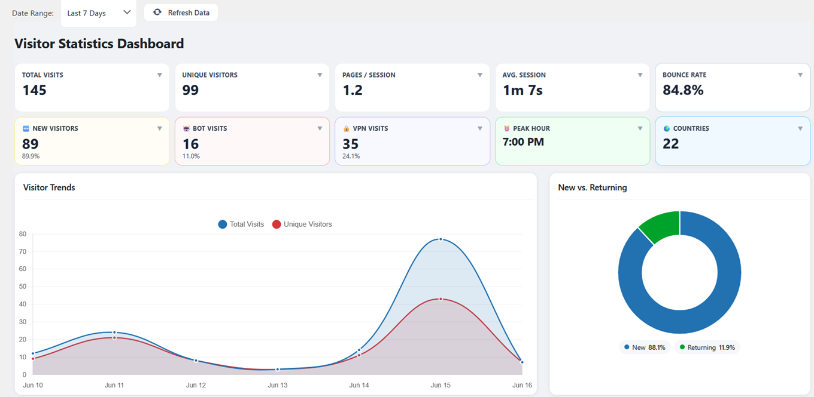

The **VPN & Bot Traffic Trend** and **Traffic Sources** panels separate normal visits from masked or automated traffic and show whether people arrive direct, from search, or from referral links. The alerts strip flags unusual patterns at a glance.

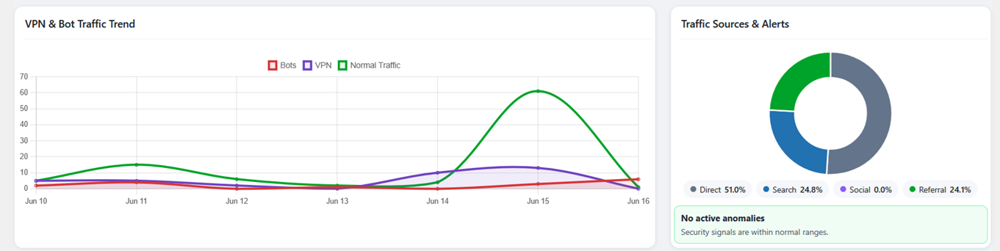

**Top Referrers** and **Top Pages** rank which inbound links and which URLs on logicencoder.com actually earn time — the table includes average time on page so you see stickiness, not just raw hits.

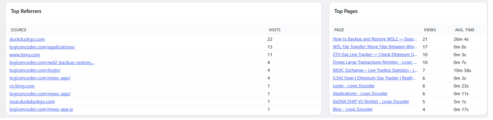

The **Traffic Heatmap** shows which hours and weekdays carry the most visits — useful for scheduling publishes, promos, or maintenance windows when the fewest real readers are online.

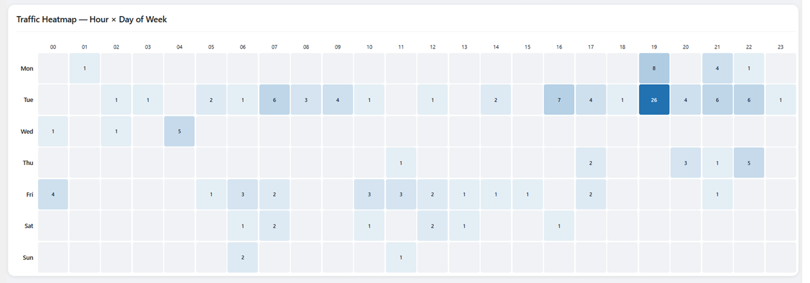

## IP addresses

**IP Addresses** is the drill-down log when you need to prove who hit a URL, from which country, on which device — and whether they were flagged as bot or VPN. Export filtered rows to CSV for offline review or handoff; ban a hostile IP from the same row without leaving the table.

**Filters** cover IP search, country dropdown, bot (All / Bots / Humans), VPN (All / VPN / Exclude VPN), and from/to date pickers. **Apply Filters**, **Reset**, and **Refresh** reload the grid without a full page reload.

**Export to CSV** downloads the current filter set as a spreadsheet (capped at a high export limit). Each row exposes:

| Action | Effect |
|--------|--------|
| **D** | Expand IP detail — geo context, ISP/org line when available |
| **B** | Open ban dialog — pre-fills IP for one-click block |

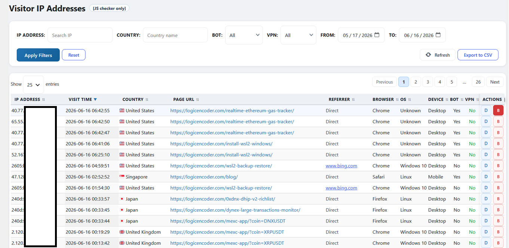

## Live visitors

**Live Visitors** shows who is on the site in the **last five minutes** — current page, country, browser, and device — with a live **Active Visitors** count. Handy when you push a launch, run a promo, or want immediate confirmation that traffic is landing on the right URL.

| Control | Behaviour |
|---------|-----------|
| **Auto-refresh** toggle | Poll for new rows on an interval (default on) |
| Refresh rate | **5s**, **10s**, **30s**, or **60s** |
| **Refresh Now** | Immediate manual reload |

## Geo reports

**Geo Reports** shows where readers come from — world map plus country, region, and city tables with visit counts, unique visitors, and VPN/proxy share. Spot geographic concentration, unexpected regions on trading or tool pages, and countries with unusually high proxy rates.

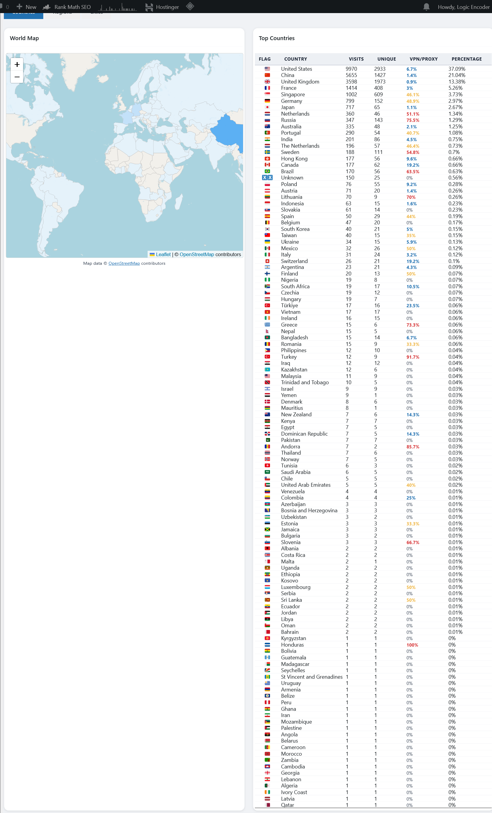

## Content analysis

**Content Analysis** ranks which URLs keep attention: page views, time on page, bounce and exit rates, plus entry and exit page lists. The **404 Error Pages** block surfaces URLs scanners and mistyped links hit most — the same signal that drives auto-ban on the Ban List.

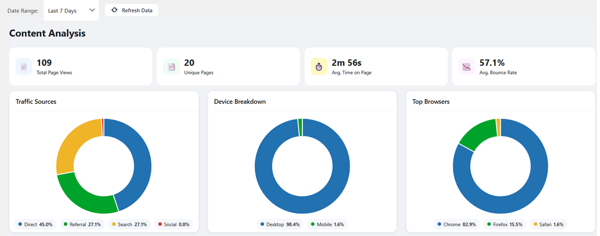

## Technology

**Technology** breaks down browsers, operating systems, and desktop vs mobile share — so you know what to test on gas tracker, MEXC pages, and long-form guides before you ship UI changes.

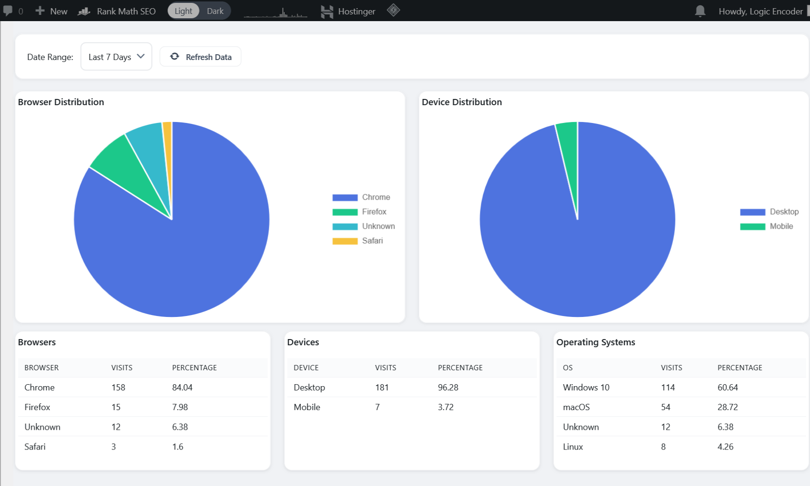

## Campaigns

**Campaigns** attributes visits to the UTM tags on your shared links — which Facebook post, newsletter, or ad campaign actually sent people to logicencoder.com. **Campaign Overview** cards and the **Top Campaigns** table list source, medium, campaign name, visits, and unique visitors for the selected range.

The built-in **How to Use UTM Tracking** guide on the same screen gives copy-paste query-string examples for social, email, and paid search — UTMs credited on the landing page carry through the rest of the session.

## Custom events

**Custom Events** counts named actions you care about — button clicks, calculator submits, funnel steps — rolled up by name, category, label, and optional numeric value. **Event Summary** cards and the **All Events** table show what fired in the date range; the on-screen guide explains how editors tag events from the front end.

## All visitors

**All Visitors** is the widest visit log — same searchable grid as IP Addresses, plus a **Source** filter when you need every recorded hit in one place. Row actions **D** (detail) and **B** (ban) match the IP screen; **CSV export** stays on IP Addresses.

## Ban list and edge blocking

**Ban List** blocks abusive IPs at the WordPress edge — scanners hammering 404s, repeat offenders, manual blocks — while a **whitelist** keeps your office, crawlers you trust, and partner ranges from ever being locked out.

| Card | Meaning |
|------|---------|
| Total Bans | All active ban rows |
| Bans Today | Blocks added today |
| 404 Attempts (7d) | Not-found hits in the last week |
| Unique IPs on 404 (7d) | Distinct offenders |
| VPN Traffic (7d) | VPN-flagged volume |

A collapsible **Top IPs with 404 hits** table highlights repeat scanners before they trip auto-ban.

**Ban Whitelist** accepts single IPs, CIDR notation, or dash ranges with a description field. Whitelisted addresses **never** auto-ban. **+ Add to Whitelist**, **Reload**, edit in a modal, or remove rows.

**Manual ban** accepts a single IP or dash range plus an optional reason — **Ban** writes immediately to the ban table.

**All Banned IPs / Ranges** paginates with page-size selector (10 / 25 / 50 / 100) and **Unban** per row. Banned visitors get **HTTP 403** before the site renders; admins are never blocked. **Auto-ban** applies when 404 hits exceed the threshold in Settings; **Stricter Rules for China** lowers that bar for Chinese geo when enabled.

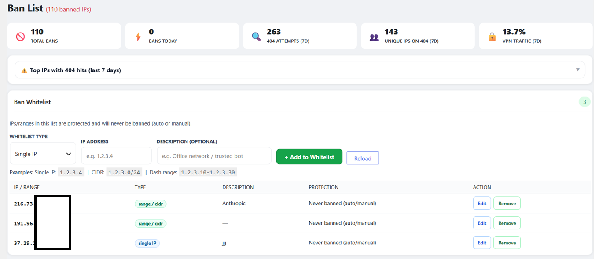

The whitelist table supports single IPs, CIDR ranges, and dash ranges with descriptions — **Anthropic**, office nets, or monitoring hosts stay protected as **Never banned (auto/manual)**.

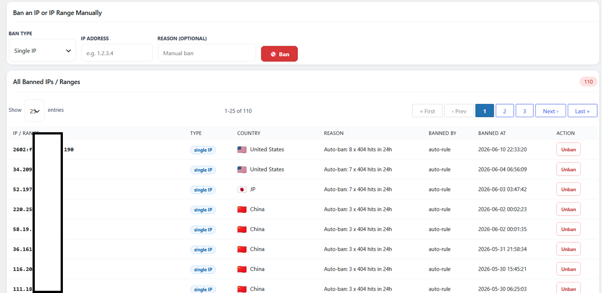

## URL shortener

**URL Shortener** gives branded `logicencoder.com/go/…` links with click counts, unique visitors, per-link stats, and top countries/referrers — share in posts, Telegram, or docs and see which short link actually converted.

**New Short Link** opens an inline form: title/note, slug, target URL → **Save** or cancel ✕.

The links table shows short URL, target, title, clicks, unique clicks, an **active/inactive** toggle, and row actions:

| Action | Effect |
|--------|--------|
| **Copy** | Clipboard the public `/go/` URL |
| **View Stats** | Inline expand with per-link analytics |
| **Edit** | Change slug, target, or title |
| **Delete** | Removes link and click history (confirm dialog) |

**Search links** filters the table client-side. **View Stats** expands a panel with day-range buttons (**7 / 30 / 90 days**), mini metrics, a bar chart of clicks over time, and top countries and referrers for that link.

The form and table below are where you create slugs, paste target URLs, toggle links active or off, and open per-link click analytics.

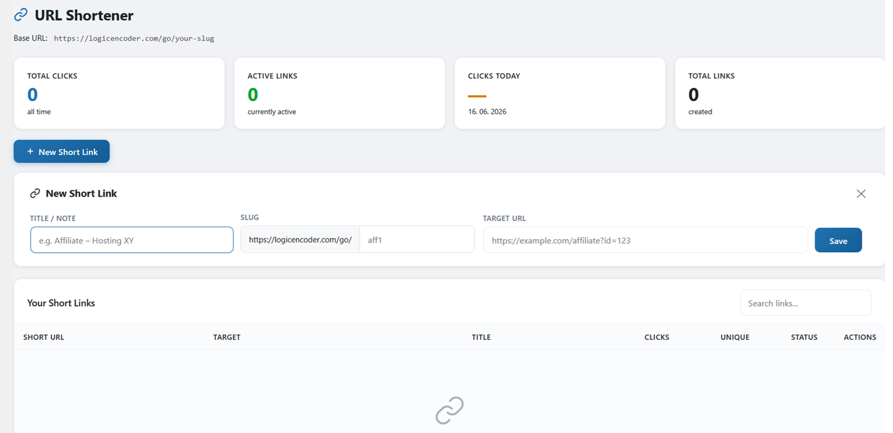

## Settings and data hygiene

**Settings** controls what gets counted (admins, bots, tracking master switches), how long rows are kept, which IPs to exclude, 404 auto-ban thresholds, display timezone, and debug logging. The **Database** card shows live row counts plus **Reset All Data**, **Remove Duplicate Visits**, and **Backup DB (SQL)** for housekeeping.

## Diagnostics

**Diagnostics** is the pre-flight screen: WordPress, PHP, MySQL, and plugin version, table health, visit/session totals, one-click **Run Tests**, and an optional debug log tail when debug mode is on.

Private code: [logicencoder/wp-visitor-stats-plugin](https://github.com/logicencoder/wp-visitor-stats-plugin) (v1.4.x runtime)

See [REPOS.md](REPOS.md).

---

**Made by [Logic Encoder](https://logicencoder.com)** · [GitHub](https://github.com/logicencoder) · [Contact](https://logicencoder.com/contact/)
