# WP Visitor Stats — WordPress analytics

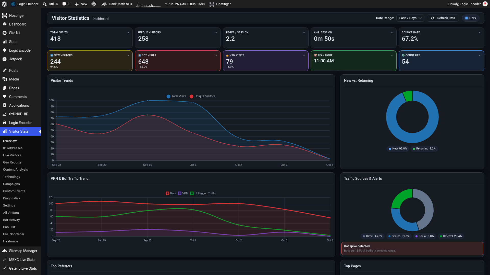

**WP Visitor Stats** brings first-party analytics, interaction heatmaps and traffic investigation into one WordPress admin menu on [logicencoder.com](https://logicencoder.com). Operators can follow visit trends, inspect individual requests, compare page performance, examine suspected automation and manage short links without sending the full clickstream to an external analytics service.

## Tech stack

| Layer | Technologies |
|-------|--------------|
| WordPress integration | PHP, WordPress hooks, authenticated admin AJAX, WP-CLI maintenance |
| Admin interface | JavaScript, jQuery, shared Logic Encoder Light/Dark palette, responsive CSS |
| Reports | Chart.js, DataTables, Leaflet and OpenStreetMap |
| Persistence | MySQL/MariaDB and WordPress options |
| Interaction visualization | First-party pointer/click collector, Canvas 2D overlays, page-preview iframe |
| Verification | Python, Playwright/Chromium, PHP and JavaScript regression tests |
| Related tools | [Gate live statistics](https://github.com/logicencoder/gate-live-stats-plugin-overview), [MEXC live statistics](https://github.com/logicencoder/mexc-live-stats-plugin-overview) |

## Shared controls and appearance

Every section uses the existing Logic Encoder admin theme. **Light** and **Dark** are two display modes of that theme, selected with the switch at the right of the shared toolbar. The section name, shared date preset and **Refresh Data** occupy one desktop row; the controls wrap below the title on small screens. Inputs, selects and ordinary action buttons use one height, while metric tiles, checkboxes, charts and multi-line fields retain sizes appropriate to their roles.

The Light mode uses the same hierarchy, spacing and controls as Dark. Switching modes changes surfaces, borders, text and chart presentation while preserving the selected report and filters. Wide data tables scroll within their own panels, and compact visitor tables can expose additional columns through their responsive row controls. No fields are discarded simply to fit a narrow screen.

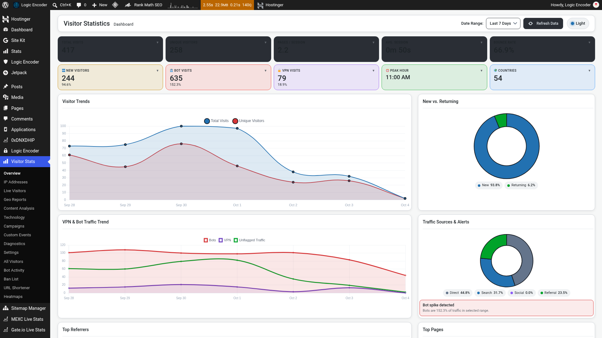

Seven reports share **Date Range**: Overview, Geo Reports, Content Analysis, Technology, Campaigns, Custom Events and Bot Activity. Each has a **Refresh Data** action; a custom range reveals start/end fields and **Apply**. Heatmaps has its own period and viewport filters, while the visit logs use their own field/date filters.

| Preset | Report window |
|--------|---------------|
| Today / Yesterday | Calendar-day reports |
| Last 24 Hours | Rolling hourly report |
| Last 3 / 7 / 30 Days | Short and longer reporting windows |
| This Month / Last Month | Calendar-month reports |
| Last 2 / 6 Months | Longer comparison periods |
| Custom Range | Operator-selected start and end dates |

## Overview dashboard

**Overview** combines headline metrics with trends: total visits, distinct visitors, pages per session, average session duration, bounce rate, new visitors, bot visits, VPN visits, peak hour and countries. Metric tiles expand into inline breakdowns, so an operator can investigate a change without navigating away from the report. The date control updates the cards and report panels together.

**Visitor Trends** compares visit volume with distinct visitors; **New vs. Returning** shows the returning-reader mix. **VPN & Bot Traffic Trend** distinguishes flagged categories from unflagged traffic, and **Traffic Sources & Alerts** helps explain unusual direct, search, social or referral activity. Lower panels expose top referrers, top pages and an hour-by-weekday traffic heatmap. That temporal heatmap describes busy times; the separate **Heatmaps** section visualizes page interactions.

Counts represent tracked records and derived aggregates. A browser-shaped request or an unflagged row is not proof of a person; automated browsers can execute JavaScript and contribute to a visit total. Operators should compare trends with **Bot Activity**, the raw log and classification reasons before interpreting a spike as audience growth.

## IP addresses

**IP Addresses** provides a searchable JavaScript-tracked visit log. The filters narrow results by address, country, bot/VPN state and dates. **Apply** updates the result set, **Reset** clears field filters, and the toolbar provides **Refresh** and **Export CSV**. Sorting and pagination let an operator inspect a large history without loading every visit into the visible table.

Rows retain URL, referrer, browser, operating system, device and classification information. **D** opens visit details and **B** starts a ban action; both have accessible descriptions in addition to their compact labels. On narrow screens the table keeps its data reachable rather than widening the entire page.

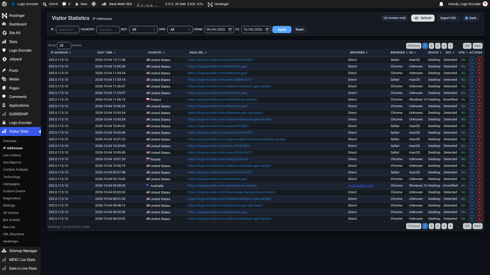

## Live visitors

**Live Visitors** shows recently active visitors within the last five minutes. **Auto-refresh** can be enabled or paused, and **Refresh rate** selects the polling interval; **Refresh Now** requests an immediate update. The active-visitor count and recent-session cards give an operator a current view without repeatedly opening the full history.

The refresh controls wrap together on mobile, preserving the refresh button and count within the page. An empty state explicitly says there are no active visitors rather than displaying stale rows. This screen reports recent activity, not independently verified human identity.

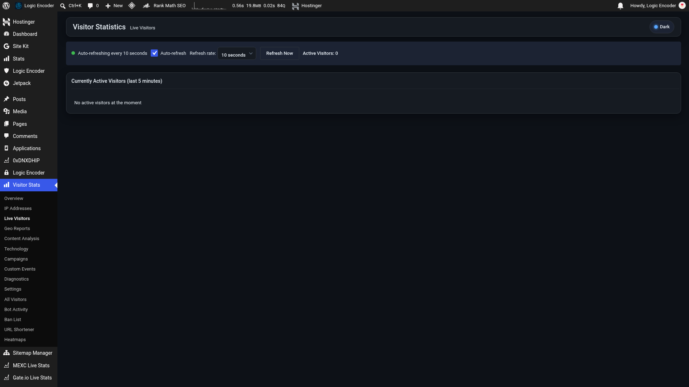

## Geo reports

**Geo Reports** offers **Countries**, **Regions** and **Cities** tabs over the selected date range. The country view pairs a world map with country totals and distinct-visitor counts. Additional tabs let an operator inspect a regional or city-level distribution, while sorting/search controls and expandable country rows support investigation of geographical concentrations.

The map keeps its own tile viewport and zoom controls. Report columns remain reachable through panel scrolling; on mobile the map and tables stack vertically instead of competing for narrow columns. Geographical and VPN/provider labels describe available lookup information and should be interpreted alongside request behavior.

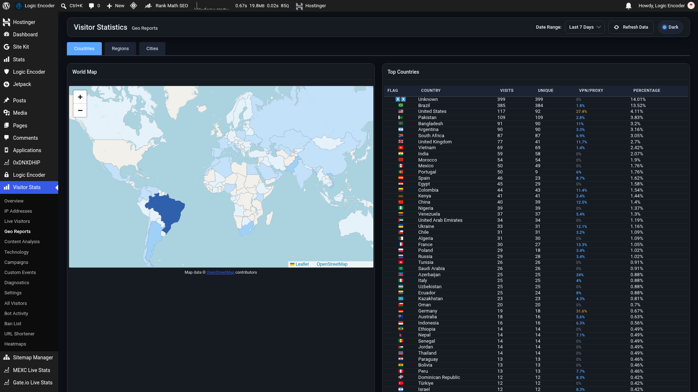

## Content analysis

**Content Analysis** helps operators compare the pages people or automated browsers request. Summary cards show page-view volume, distinct pages, average time on page and bounce behavior; accompanying device, browser and timing charts provide context. The **Page Performance** table brings view counts, distinct views, time, bounce and exit measures together for each URL.

Entry-page and exit-page panels help trace where sessions begin and end. The report also exposes likely 404 pages and related traffic breakdowns for investigating broken or unwanted paths. Tables remain searchable and scroll inside their cards on small screens, while charts resize to the available width.

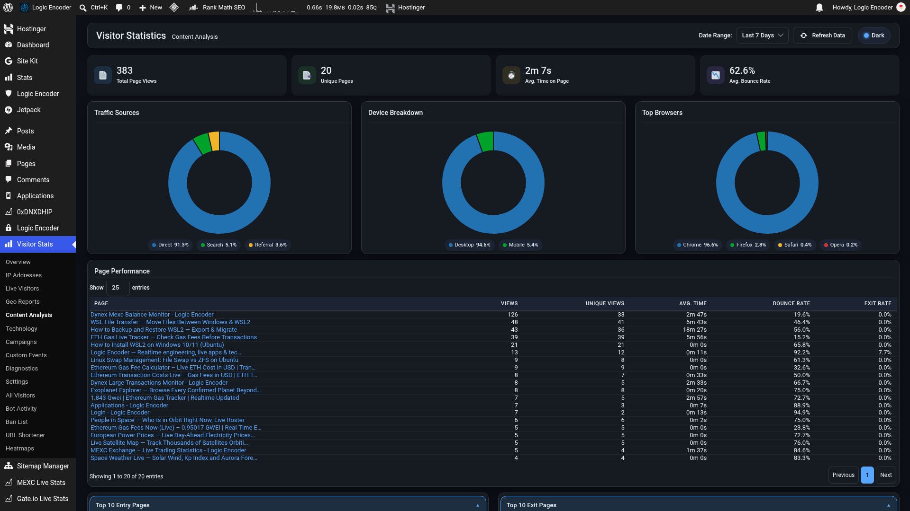

## Technology

**Technology** groups tracked requests by browser, operating system and device. Charts show the mix and the associated tables expose counts, so an operator can compare desktop/mobile usage or spot an unusually concentrated browser signature. The shared period and refresh action keep these breakdowns aligned with other analytic reports.

These are reported or inferred client properties, not an authentication mechanism. A repeated Chrome/macOS signature can belong to automation. The page uses the shared card layout and stacks chart/table columns when the viewport narrows.

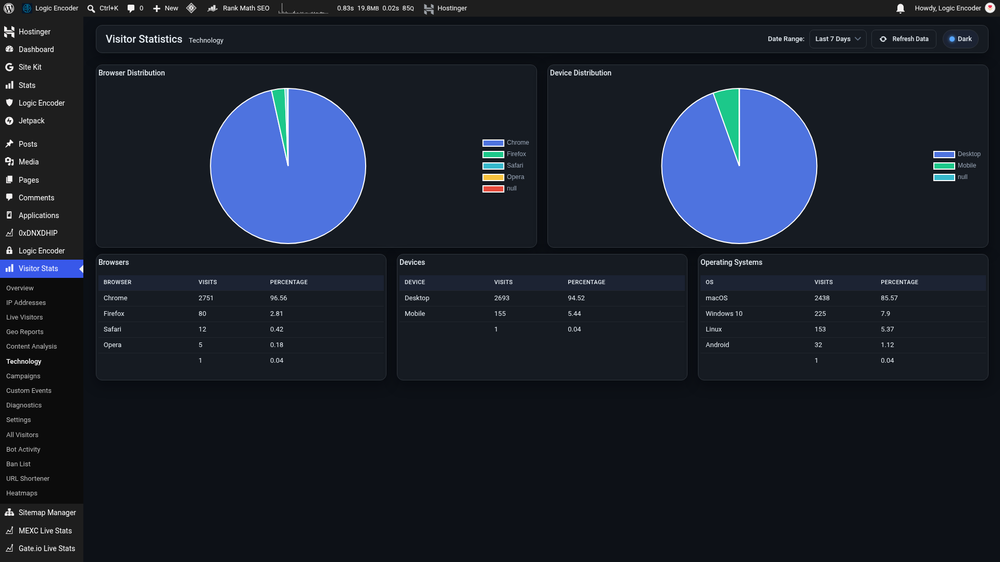

## Campaigns

**Campaigns** summarizes UTM-attributed traffic across source, medium and campaign. Operators can compare tagged acquisition activity over the shared reporting period and inspect campaign rows rather than trying to infer campaign performance from referrer URLs alone. The in-admin tracking guide explains how to tag links for the collector.

The page separates campaign totals and distribution panels from the guide. Long parameter examples remain horizontally scrollable in their own code blocks, so the documentation does not push a mobile page beyond its viewport.

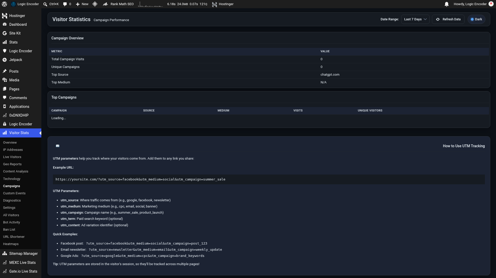

## Custom events

**Custom Events** reports named interactions submitted by the site's event API. **All event names** and **All categories** narrow the data, and **Refresh** reloads those filters. The summary cards expose event counts, distinct names/categories, sessions and numeric value; trend, category and top-name charts give a visual comparison.

**All Events** groups name/category/label combinations, while **Recent Events** shows individual recent records. The embedded guide documents the event fields and JavaScript call. Charts respect their grid's available width and event tables/code examples scroll within their panels, including when the selected range contains no events.

```javascript
wpVisitorStatsTrackEvent('button_click', 'engagement', 'header_cta', 1);
```

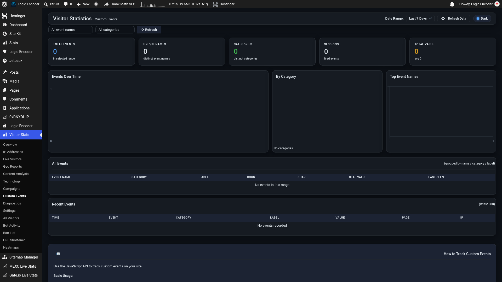

## Interaction heatmaps

**Visitor Stats → Heatmaps** shows recorded clicks, sampled mouse movements and scroll reach over a page preview. The **Page**, **Period**, **Device** and **Recorded viewport** filters select a comparable cohort before rendering. Summary cards show page views, clicks, movement samples and median scroll reach; **Refresh** requests the selected cohort again.

**Clicks** and **Mouse movement** render density overlays, while **Scroll depth** shows how far recorded views reached. **Overlay opacity** adjusts readability over the preview, and the low-to-high legend explains the density scale. Keeping desktop/mobile and recorded widths separate avoids mixing coordinates from incompatible page layouts.

The preview uses the current page layout at the recorded viewport; it is not a historical DOM recording or a video replay. Page changes can therefore affect alignment with older interactions. Form values and typed text are not collected, previews do not record new interaction views, and excluded/admin/bot sessions are not accepted as ordinary collection data. Empty cohorts display an explicit message.

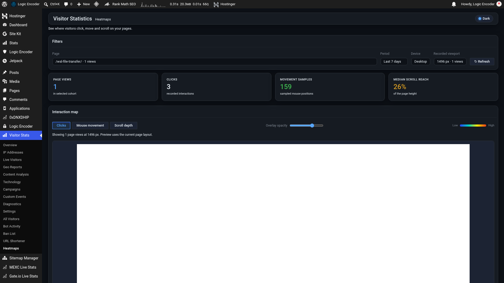

## All visitors

**All Visitors** exposes the full request log, including JavaScript tracking and optional server-side fallback. Segment cards distinguish **Unverified browsers**, **Bots**, other requests and all records; the source selector lets an operator compare the capture paths without assuming JavaScript execution proves a real person.

The table combines field/date filters, searching, sorting, pagination, details, export and ban actions. Classification reasons explain a detector result or suspected automation, while an unverified label explicitly preserves uncertainty. This is the investigation screen to use when a chart spike consists of many direct visits with an identical browser/screen signature.

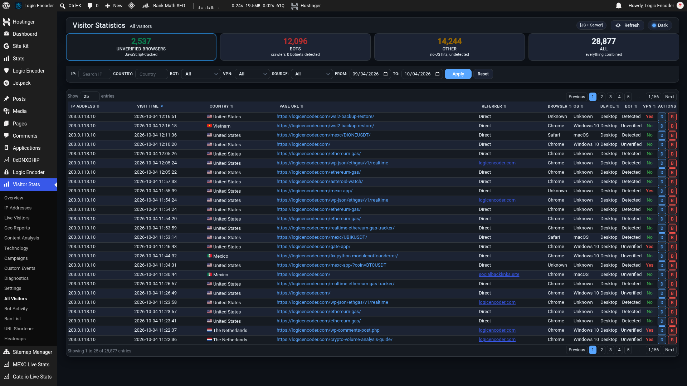

## Bot activity

**Bot Activity** focuses on flagged traffic. Summary metrics and a timeline show volume, distinct addresses, agents and attack-related requests. Agent breakdowns, target categories, popular URLs and busy sessions help distinguish ordinary indexing from repeated probes against credentials, authentication endpoints or public tool routes.

The screen includes complete target-category totals as well as a top-target list, so a popular URL does not hide lower-volume categories. Classification labels are evidence to investigate; a provider/network address alone is not treated as proof of a malicious visitor.

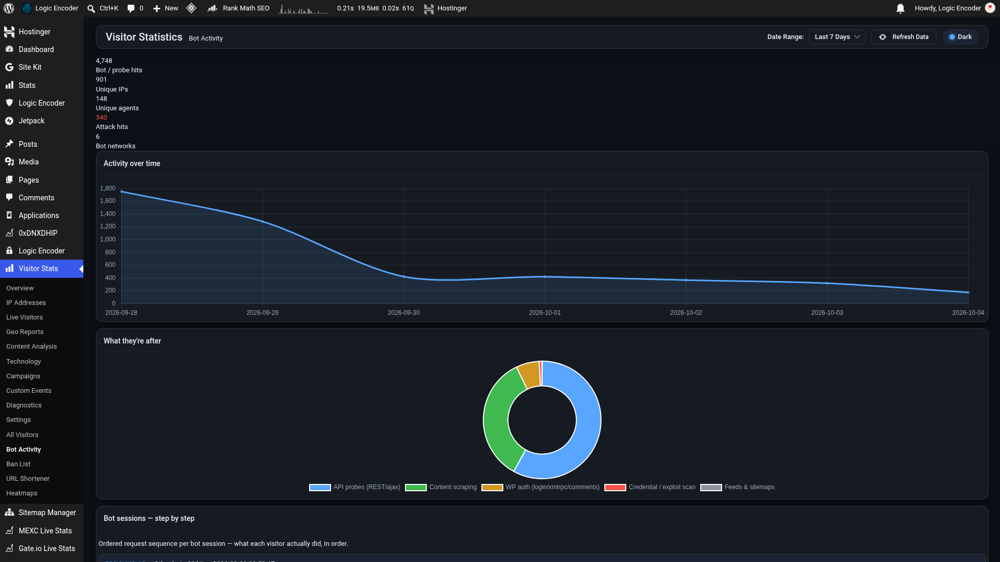

## Ban list and edge blocking

**Ban List** combines security summaries, a whitelist, a manual-ban form and existing bans. Whitelist entries can use a single address or a supported range/CIDR notation; their description helps distinguish office networks and trusted services from temporary exceptions. **Edit** opens a bounded dialog, while removals and ban/unban actions remain explicit operator actions.

The manual form accepts an address or range and a reason. Auto-ban thresholds in Settings govern configured suspicious-request patterns, and protected whitelist entries are kept separate from normal bans. Tables scroll within their panels, and the range forms and edit dialog remain usable on mobile.

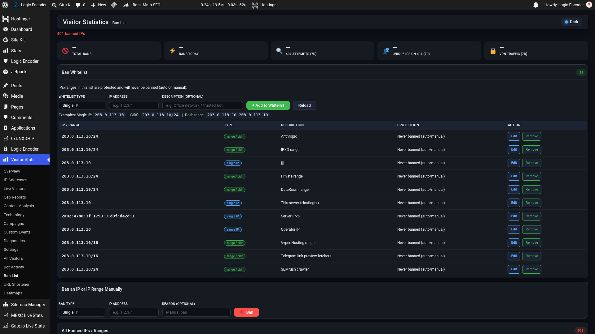

## URL shortener

**URL Shortener** creates branded `/go/{slug}` links on the same site. **New Short Link** opens an inline form for **Title / Note**, **Slug** and **Target URL**; **Save** commits a valid link, and the close control cancels editing. The short-link prefix stays visible while the slug input takes the remaining field width.

The link list supports searching, active-state toggles, editing and per-link statistics for clicks, distinct visitors, countries and referrers. On narrow screens the create/edit grid becomes one column and the results table scrolls horizontally. These short links intentionally redirect to their configured targets; analytics report URLs and heatmap pages are separate controls.

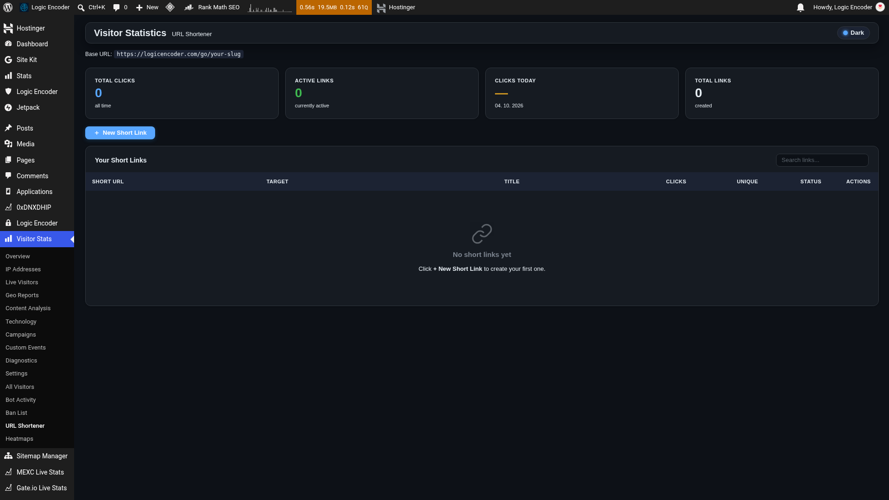

## Settings and data hygiene

**Settings** controls whether admins/bots are tracked, whether JavaScript and server-side capture are enabled, how long records are retained and which addresses are excluded. The optional display-timezone picker changes how report times are presented while preserving the underlying recording clock. Security settings tune the configured automatic-ban rules.

Maintenance actions include saving exclusions, removing excluded visits, duplicate cleanup, database backup and resetting data. Their descriptions and confirmations distinguish ordinary settings changes from destructive maintenance. Multi-line exclusion fields and long timezone choices stay within the screen width; regular action buttons retain the common control height.

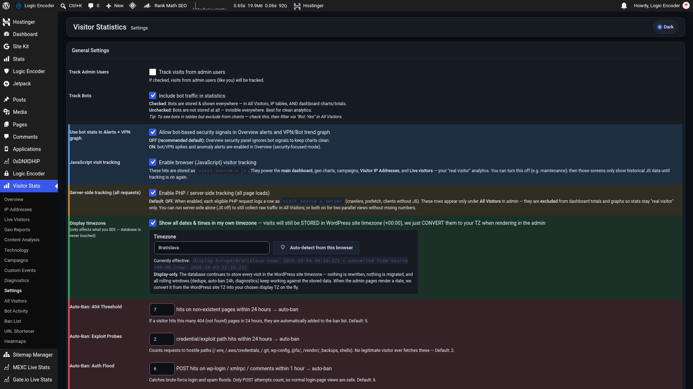

## Diagnostics

**Diagnostics** presents plugin/environment information and tracking checks for investigating empty or unexpected reports. Operators can inspect report prerequisites and run the available checks before changing capture settings. When debug logging is enabled, the log view provides additional investigation data.

Wide diagnostic tables and long messages stay within their own panels, and ordinary test/action buttons match the rest of Visitor Stats. Diagnostics supports troubleshooting; it does not turn uncertain visitor classifications into confirmed human identities.

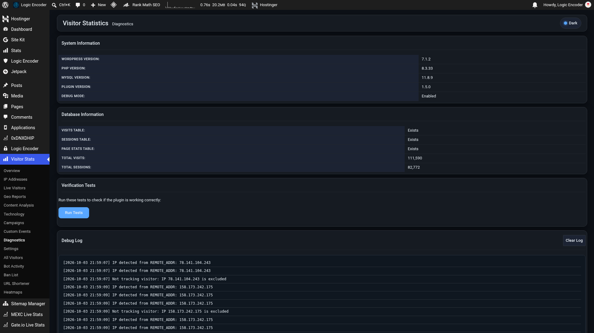

## Responsive verification

The current layout was measured in Chromium across all 15 sections at 360, 390, 768, 1024, 1440 and 1920 CSS pixels, in both display modes of the existing Logic Encoder theme. Separate interaction checks open geographical tabs, link creation, whitelist dialogs, address details, custom dates and timezone controls. Interaction heatmaps are additionally exercised from browser input through collection, persistence and overlay rendering.

Images are native 1920 × 1080 browser captures. Visitor identifiers are replaced with documentation examples and temporary WordPress admin notices are hidden for presentation; the product controls and report structure remain the actual interface. Detailed test results and operational evidence belong in the private source repository.

Private code: [wp-visitor-stats-plugin](https://github.com/logicencoder/wp-visitor-stats-plugin)
Related repositories: [REPOS.md](REPOS.md)

---

**Made by [Logic Encoder](https://logicencoder.com)** · [GitHub](https://github.com/logicencoder) · [Contact](https://logicencoder.com/contact/)


The compact interface uses 28px general controls and 24px row actions and pagination. All 15 sections passed 180 responsive browser cases; a further 60 cases explicitly checked pagination and action anchors. Reference captures show the deployed compact layout with visitor identifiers masked. JavaScript-tracked visits indicate browser execution, not verified human identity.
