# WP Visitor Stats

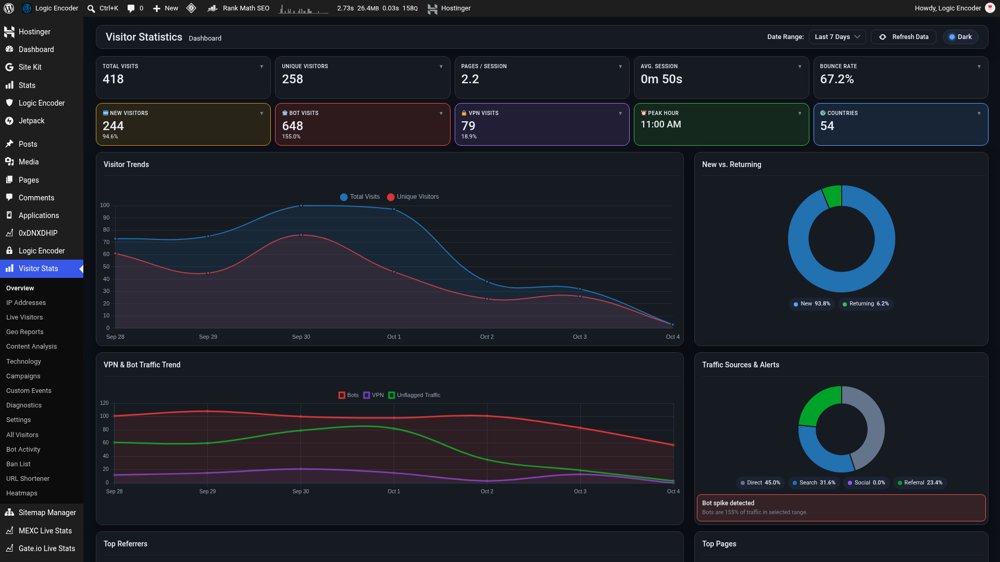

Understanding a website's audience can become fragmented across traffic reports, campaign tools and access logs. WP Visitor Stats brings those views into WordPress, helping the owner inspect how people reach the site, what they use and where a closer look is needed.

## Tech stack

| Layer | Technologies |
|---|---|
| Application | PHP, WordPress |
| Supporting technologies | JavaScript, HTML, CSS; MySQL |

## Understand visits and content

The overview brings key traffic information together, while content reports help examine which pages receive attention. Shared date and filter controls keep comparisons focused on the same question. Live views provide a more immediate picture when checking a current publishing or campaign event.

Start with the period and question, then move from the overview into the relevant content or live report. Shared filters make those different views easier to compare coherently.

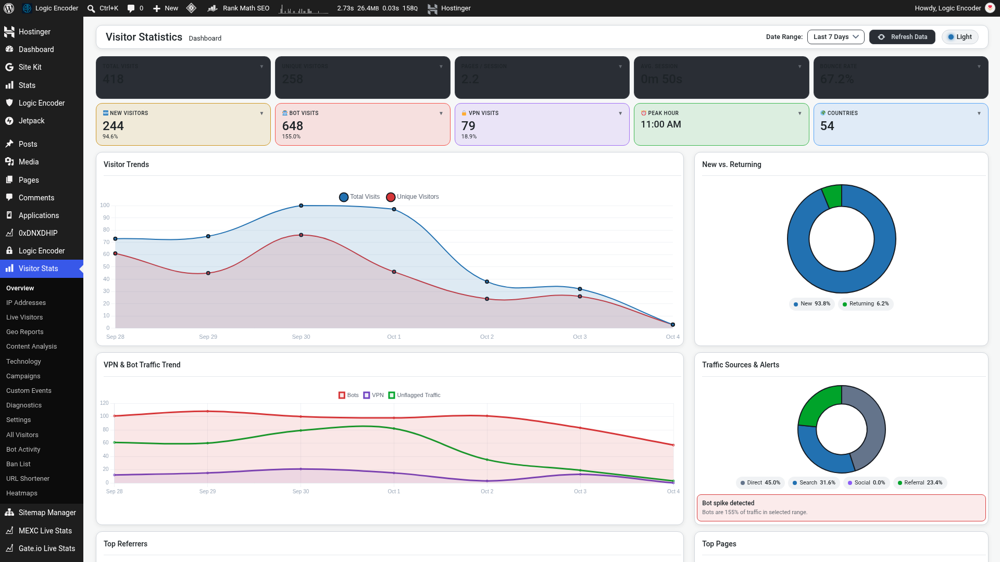

The live traffic view supports checking an event while it is happening. It complements period-based reports when the question concerns a current campaign or publishing change.

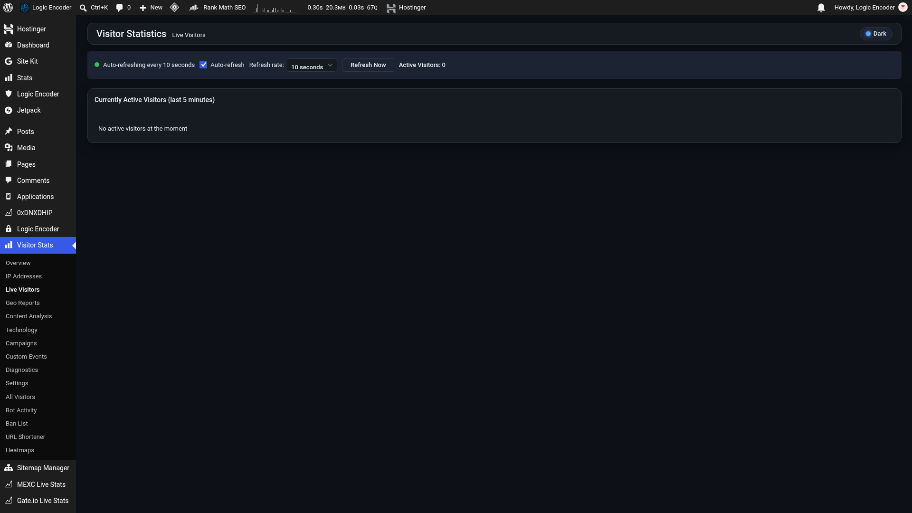

Content reports organise the investigation around the pages receiving attention. They help move from an overall traffic figure to the material visitors actually reached.

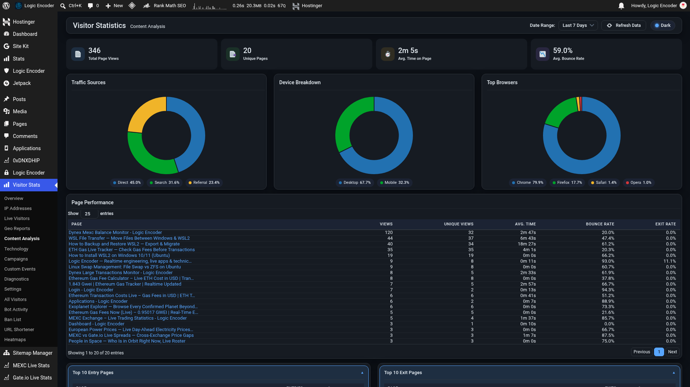

## Explore audience context

Geographic and technology reports add context about where visits come from and how the site is being used. The visitor list offers a route into individual records when aggregate figures are insufficient. These views support investigation without treating an address alone as a complete picture of a person.

Geography, technology and individual records offer complementary perspectives on traffic. Use the level of detail suited to the question rather than expecting one aggregate figure to explain every visit.

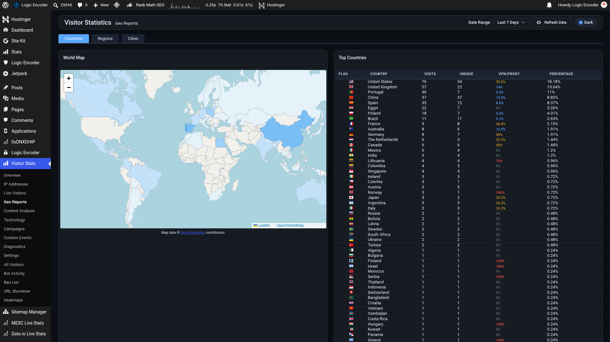

Technology reports add the device and browser context available for the selected traffic. They support a different question from geography while remaining part of the same analytics workspace.

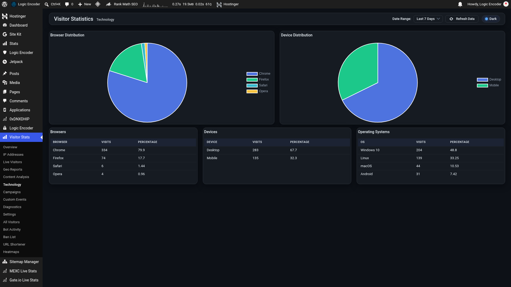

The visitor-record view supports cases that need more detail than a summary chart. Use it to examine the records relevant to the selected period and question.

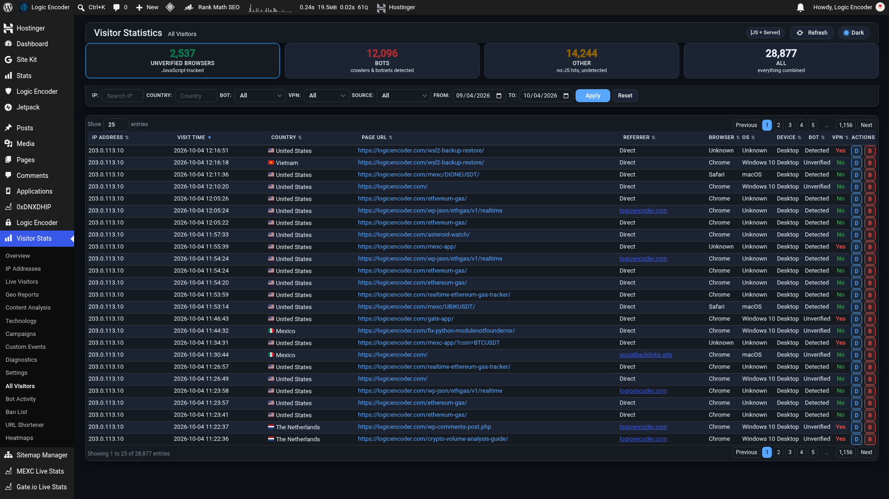

## Connect campaigns and interactions

Campaign reports, custom events and interaction heatmaps help examine how visitors engage beyond the initial page view. The built-in short-link tools support sharing and tracking selected destinations. Keeping these areas together makes it easier to follow a campaign from arrival to interaction.

A campaign can lead to more than a landing-page visit. Following the available events, links and interactions helps the owner examine what happened after arrival.

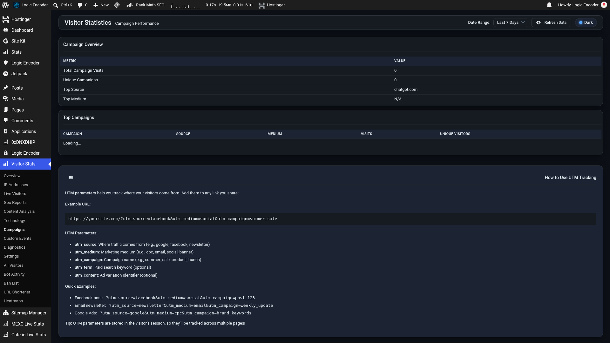

Custom events help the owner examine interactions beyond the initial page view. They connect the traffic report with the actions the site is set up to observe.

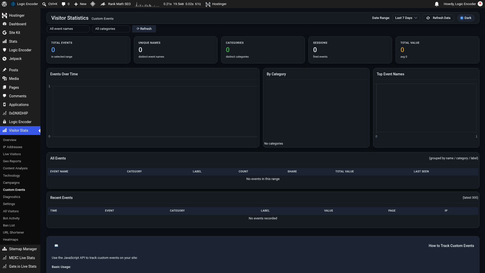

Interaction heatmaps show where visitors click, where the mouse lingers and how far they scroll. The Heatmaps screen filters by page, period, device class and the exact viewport width that was recorded, and draws click and mouse-movement density overlays and scroll-reach on a preview of the page. Capture is deliberately narrow: pointer events only, mouse movement sampled at most four times a second and sent in batches every ten seconds. No input values, keystrokes or page text are read or stored, and any element marked `data-wpvs-private` is left out. Bots, administrators, excluded IP addresses, visitors who send Do Not Track and preview frames are excluded. The preview shows the current page layout, not a historical snapshot, and visits recorded before heatmaps existed have no coordinates and cannot be reconstructed.

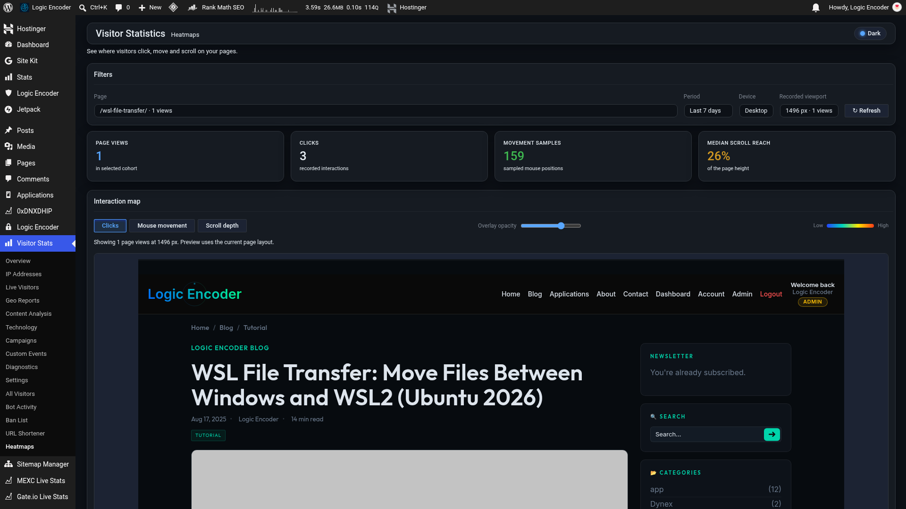

Short-link tools connect shared destinations with the corresponding tracking workflow. They help review a campaign from the link being shared through the available observations.

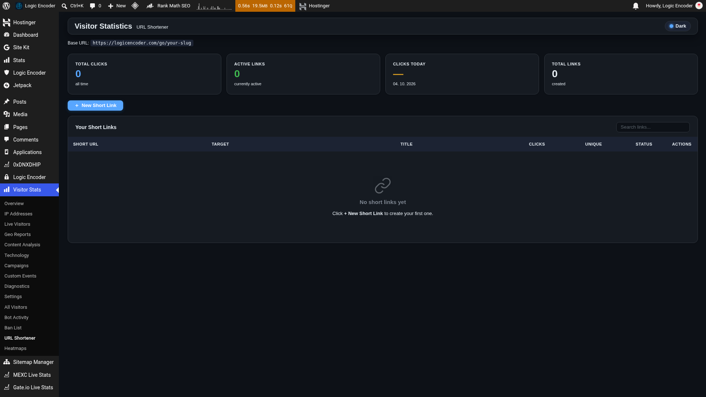

## Separate automation and unwanted traffic

Bot activity and ban-management views help the owner inspect traffic that needs a different response. Available edge-blocking controls support the configured access workflow. They are operational tools whose effects should be reviewed in the relevant reports.

Automation and unwanted activity deserve their own review rather than being silently mixed into audience interpretation. Inspect the relevant records and the effect of configured controls in context.

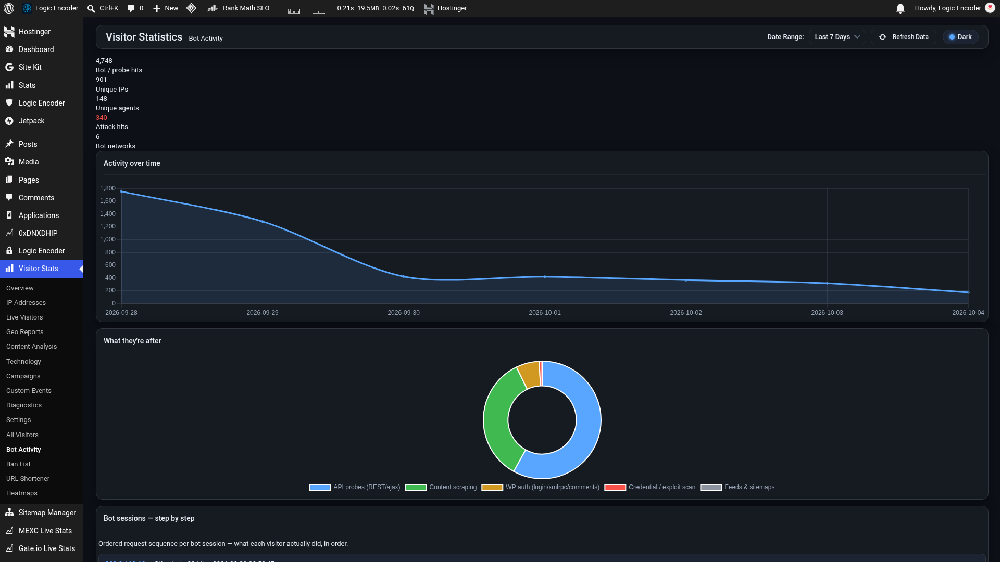

Ban management lists the banned addresses, lets the owner ban and unban an address and keeps a whitelist of addresses that must never be banned. A ban list that only grows is a risk in itself, so review the affected records and the reason before changing an access choice.

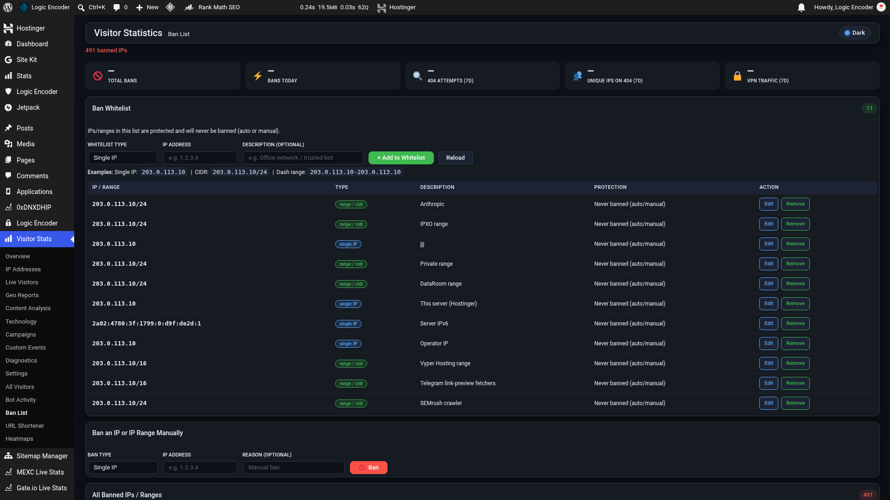

## Maintain the analytics workspace

Settings cover the data-retention period (180 days by default), the excluded addresses and the tracking options. Data hygiene tools can remove duplicate visit records, purge all stored data for one IP address on request, export the visitor records to CSV and create a database backup first. Because the plugin stores visitor addresses, countries and a VPN flag, a site that uses it needs a stated legal basis, a privacy-notice entry and the retention limit; honouring Do Not Track is a setting: when it is on, such visitors are not tracked and are left out of the reports, and heatmaps always exclude them.

Report usefulness depends on maintaining the surrounding setup as well as reading the figures. Privacy preferences, data hygiene and diagnostics give that work a clear place in the administration routine.

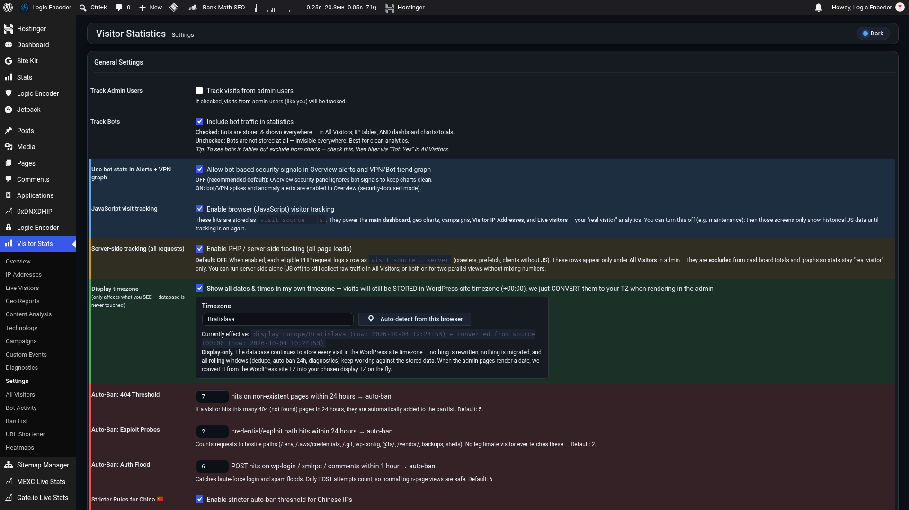

Diagnostics support checking the analytics installation itself. Use them when an unexpected number or missing view might reflect collection or configuration rather than audience behaviour.

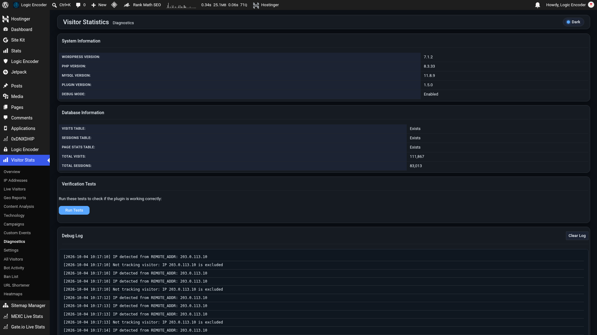

---

Private code: [wp-visitor-stats-plugin](https://github.com/logicencoder/wp-visitor-stats-plugin)

See [REPOS.md](REPOS.md) for related repositories.

**[Logic Encoder](https://logicencoder.com)** · [GitHub](https://github.com/logicencoder) · [Contact](https://logicencoder.com/contact/)
